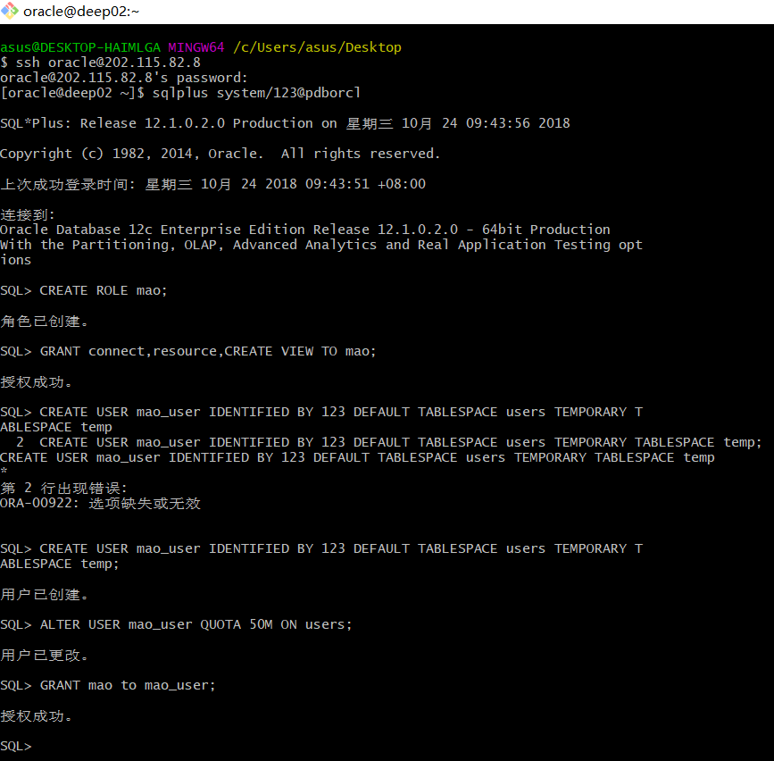
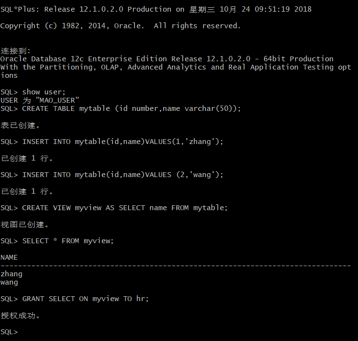
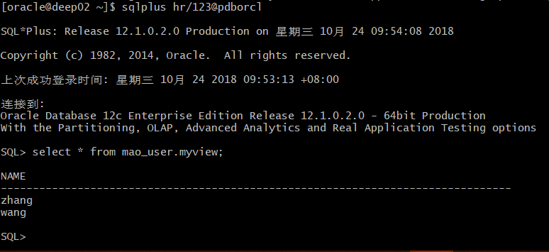

# 实验2：掌握管理角色、权根、用户的能力，并在用户之间共享对象。

## 实验过程
- 1：在pdborcl插接式数据中创建一个新的本地角色mao，该角色包含connect和resource角色，
同时也包含CREATE VIEW权限，这样任何拥有mao的用户就同时拥有这三种权限。  
- 2：创建角色之后，再创建用户mao_user，给用户分配表空间，设置限额为50M，授予mao角色。

- 3: 新用户mao_user连接到pdborcl，创建表mytable和视图myview，插入数据，最后将myview的
SELECT对象权限授予hr用户。

- 4:用户hr连接到pdborcl，查询mao_user授予它的视图myview
