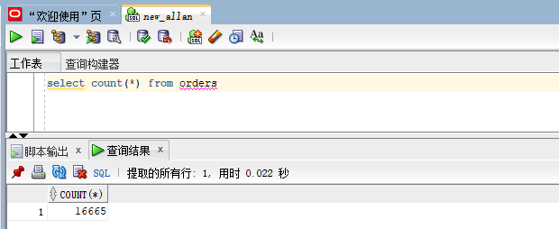

# 实验三
## 用户名：mao_user
### 1.创建表和分区
- 创建orders表及分区
```sql
CREATE TABLE orders 
(
 order_id NUMBER(10, 0) NOT NULL 
 , customer_name VARCHAR2(40 BYTE) NOT NULL 
 , customer_tel VARCHAR2(40 BYTE) NOT NULL 
 , order_date DATE NOT NULL 
 , employee_id NUMBER(6, 0) NOT NULL 
 , discount NUMBER(8, 2) DEFAULT 0 
 , trade_receivable NUMBER(8, 2) DEFAULT 0 
) 
TABLESPACE USERS 
PCTFREE 10 INITRANS 1 
STORAGE (   BUFFER_POOL DEFAULT ) 
NOCOMPRESS NOPARALLEL 
PARTITION BY RANGE (order_date) 
(
 PARTITION PARTITION_BEFORE_2017 VALUES LESS THAN (
 TO_DATE(' 2017-01-01 00:00:00', 'SYYYY-MM-DD HH24:MI:SS', 
 'NLS_CALENDAR=GREGORIAN')) 
 NOLOGGING 
 TABLESPACE USERS 
 PCTFREE 10 
 INITRANS 1 
 STORAGE 
( 
 INITIAL 8388608 
 NEXT 1048576 
 MINEXTENTS 1 
 MAXEXTENTS UNLIMITED 
 BUFFER_POOL DEFAULT 
) 
NOCOMPRESS NO INMEMORY  
, PARTITION PARTITION_BEFORE_2018 VALUES LESS THAN (
TO_DATE(' 2018-01-01 00:00:00', 'SYYYY-MM-DD HH24:MI:SS', 'NLS_CALENDAR=GREGORIAN')) 
NOLOGGING 
TABLESPACE USERS02 
PCTFREE 10 
 INITRANS 1 
 STORAGE 
( 
 INITIAL 8388608 
 NEXT 1048576 
 MINEXTENTS 1 
 MAXEXTENTS UNLIMITED 
 BUFFER_POOL DEFAULT 
) 
NOCOMPRESS NO INMEMORY 
, PARTITION PARTITION_BEFORE_2019 VALUES LESS THAN (
TO_DATE(' 2019-01-01 00:00:00', 'SYYYY-MM-DD HH24:MI:SS', 'NLS_CALENDAR=GREGORIAN')) 
NOLOGGING 
TABLESPACE USERS03 
PCTFREE 10 
 INITRANS 1 
 STORAGE 
( 
 INITIAL 8388608 
 NEXT 1048576 
 MINEXTENTS 1 
 MAXEXTENTS UNLIMITED 
 BUFFER_POOL DEFAULT 
) 
NOCOMPRESS NO INMEMORY 
);
```

- 设置orders表的主键：
```sql
alter table orders add primary key (order_id)alter table orders add primary key (order_id)
```

- 创建order_details表及分区
```sql
CREATE TABLE order_details 
(
id NUMBER(10, 0) NOT NULL 
, order_id NUMBER(10, 0) NOT NULL
, product_id VARCHAR2(40 BYTE) NOT NULL 
, product_num NUMBER(8, 2) NOT NULL 
, product_price NUMBER(8, 2) NOT NULL 
, CONSTRAINT order_details_fk1 FOREIGN KEY  (order_id)REFERENCES orders  (  order_id   )
ENABLE 
) 
TABLESPACE USERS 
PCTFREE 10 INITRANS 1 
STORAGE (   BUFFER_POOL DEFAULT ) 
NOCOMPRESS NOPARALLEL
PARTITION BY REFERENCE (order_details_fk1)
(
PARTITION PARTITION_BEFORE_2017 
NOLOGGING 
TABLESPACE USERS
PCTFREE 10 
 INITRANS 1 
 STORAGE 
( 
 INITIAL 8388608 
 NEXT 1048576 
 MINEXTENTS 1 
 MAXEXTENTS UNLIMITED 
 BUFFER_POOL DEFAULT 
) 
NOCOMPRESS NO INMEMORY
,PARTITION PARTITION_BEFORE_2018
NOLOGGING 
TABLESPACE USERS02
PCTFREE 10 
 INITRANS 1 
 STORAGE 
( 
 INITIAL 8388608 
 NEXT 1048576 
 MINEXTENTS 1 
 MAXEXTENTS UNLIMITED 
 BUFFER_POOL DEFAULT 
) 
NOCOMPRESS NO INMEMORY  
,PARTITION PARTITION_BEFORE_2019
NOLOGGING 
TABLESPACE USERS03
PCTFREE 10 
 INITRANS 1 
 STORAGE 
( 
 INITIAL 8388608 
 NEXT 1048576 
 MINEXTENTS 1 
 MAXEXTENTS UNLIMITED 
 BUFFER_POOL DEFAULT 
) 
NOCOMPRESS NO INMEMORY  
);
```

### 2.分配权限
- 分配查询权限
```sql
grant select on mao_user.ORDERS to mao;
```

```sql
grant select on mao_user.ORDER_DETAILS to mao;
```

- 分配表空间权限
```sql
grant UNLIMITED TABLESPACE to mao_user;
```

## 二、插入数据并进行联合查询
### 对orders表使用执行过程插入数据

执行过程：

```SQL
declare 
  m integer; 
begin 

--输出开始时间 
  dbms_output.put_line('start:'||sysdate); 
  m:=5555;

--循环插入的数据量 
  for i in 1..5555 loop 
   m:=m+1; 
insert into ORDERS (ORDER_ID,CUSTOMER_NAME,CUSTOMER_TEL,ORDER_DATE,EMPLOYEE_ID,DISCOUNT,TRADE_RECEIVABLE) 
values (m,'user'||m,'10000',to_date('2017-05-04 00:00:00', 'SYYYY-MM-DD HH24:MI:SS'),001,15,29);
    commit; 
  end loop; 
--输出结束时间 
  dbms_output.put_line('end:'||sysdate); 
end;
```

通过修改m值以及时间达到平均插入到不同的分区里面。总共的数据为16665条，其中每一分区含有5555条记录。

执行结果：


#### 查询orders表插入的总共记录数

```SQL
select count(*) from orders
```
执行结果：



#### 查询所有记录数

```SQL
select * from orders
```

执行结果：


### 对order_details表使用执行过程插入数据

```SQL
declare 
  m integer; 
begin 

--输出开始时间 
  dbms_output.put_line('start:'||sysdate); 
  m:=8334;

--循环插入的数据量 
  for i in 1..5000 loop 
   m:=m+1; 
insert into ORDER_DETAILS (ID,ORDER_ID,PRODUCT_ID,PRODUCT_NUM,PRODUCT_PRICE) 
values (m,m,'product'||m,15,29);
    commit; 
  end loop; 
--输出结束时间 
  dbms_output.put_line('end:'||sysdate); 
end;
```

通过对order_id的值进行改变，实现关联order表中的外键，并分配到各个分区里面，向order_details表中共插入19997条数据。

#### 查询order_details表插入的总共记录数

```SQL
select count(*) from orders_details
```
执行结果：

;

#### 对表中数据进行联合查询
```SQL
select 
    orders.order_id as AID,
    orders.customer_name as customer_name,
    order_details.order_id as BID,
    ORDER_DETAILS.PRODUCT_ID as product_id
from
    ORDERS
INNER JOIN ORDER_DETAILS ON (orders.order_id=order_details.order_id);
```

执行结果：


### 分析执行计划
#### 执行计划SQL语句
```SQL
EXPLAIN plan for
select 
    orders.order_id as AID,
    orders.customer_name as customer_name,
    order_details.order_id as BID,
    ORDER_DETAILS.PRODUCT_ID as product_id
from
    ORDERS
INNER JOIN ORDER_DETAILS ON (orders.order_id=order_details.order_id);
select * from table(dbms_xplan.display());
```
执行结果：


由执行计划可知：最先执行的是PARTITION REFERENCE ALL，对分区进行引用。

然后执行的是TABLE ACCESS FULL，即是优先对order_details表进行全表扫描。

其次是INDEX UNIQUE SCAN对order_id进行索引唯一扫描，因为order_details的外键是order_id。

因为SQL语句中使用了join，所以需要进行了NESTED LOOPS连接查询。
