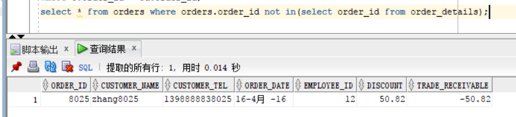

## 实验四 对象管理

### 前提说明
- 使用用户： `mao_user`

### 运行sql运行sql

### 实验部分
- 1.从orders表中查询任一个
```sql
order_idselect * from orders where order_id=8024;
```

- 2.从order_details表中查询该order_id的相关信息
```sql
 select * from order_details where order_id=8024;
```

- 3.更新指定id在order_details表中的product_num值
```sql
update order_details set product_num=5 where id=24070;
```

- 4.验证更改是否成功：验证更改是否成功：
```sql
 select * from order_details where order_id=8024;
```

- 5.更新指定id在order_details表中的product_price值并查看结果
```sql
update order_details set product_price=8000.5 where id=24070;
```

- 6.删除order_details表中的数据
```sql
delete from order_details where order_id=24073;
```

- 7.向order_details表中插入数据
```sql
insert into order_details values (300001,8022,'mao',1,4000);
```
;
- 验证插入

- 8.查询谋某个员工信息：
```sql
SELECT * from employees where employee_id=12;
```

- 9.递归查询某个员工及其所有下属，子下属员工。
```sql
SELECT * FROM employees START WITH EMPLOYEE_ID = 11 CONNECT BY PRIOR EMPLOYEE_ID = MANAGER_ID;
```

- 10.查询订单表，并且包括订单的订单应收货款: Trade_Receivable= sum(订单详单表.ProductNum*订单详单表.ProductPrice)- Discount。
```sql
 SELECT
     order_id,
     pay-discount as Trade_Receivable
     from
         (select
             orders.order_id as order_id,
             ORDERS.DISCOUNT as discount,
             sum(PRODUCT_NUM*PRODUCT_PRICE) as pay
             from ORDER_DETAILS 
             inner join ORDERS on(orders.order_id=order_details.order_id) 
             group by orders.order_id, ORDERS.DISCOUNT
     );
```

- 11.查询订单详表，要求显示订单的客户名称和客户电话，产品类型用汉字描述。
```sql
select o.CUSTOMER_NAME as "顾客名称", o.CUSTOMER_TEL as "顾客电话", od.PRODUCT_NAME as "产品类型"
from ORDERS o, ORDER_DETAILS od
where o.order_id = od.order_id;
```

- 12.查询出所有空订单，即没有订单详单的订单。
```sql
select * from orders where orders.order_id not in(select order_id from order_details);
```

- 13.查询部门表，同时显示部门的负责人姓名。
```sql
select DEPARTMENT_NAME as "部门",MANAGER_ID as "部门负责人" 
     from DEPARTMENTS d,EMPLOYEES e
     where d.DEPARTMENT_ID=e.DEPARTMENT_ID;
select DEPARTMENT_NAME as "部门",MANAGER_ID as "部门负责人" 
     from DEPARTMENTS d,EMPLOYEES e
     where d.DEPARTMENT_ID=e.DEPARTMENT_ID;

```

- 14.查询部门表，统计每个部门的销售总金额。
```sql
select DEPARTMENT_NAME,SUM(o.Trade_Receivable)AS "销售总金额"
     from DEPARTMENTS d,EMPLOYEES e,ORDERS o
     where d.DEPARTMENT_ID=e.DEPARTMENT_ID and e.EMPLOYEE_ID=o.EMPLOYEE_ID group by DEPARTMENT_NAME;
```


