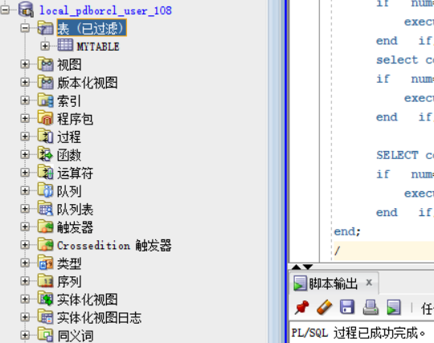
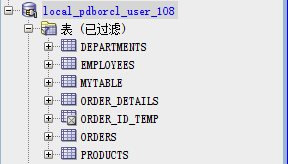
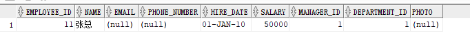
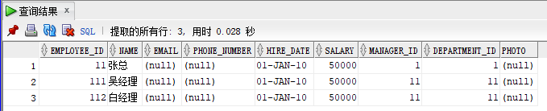
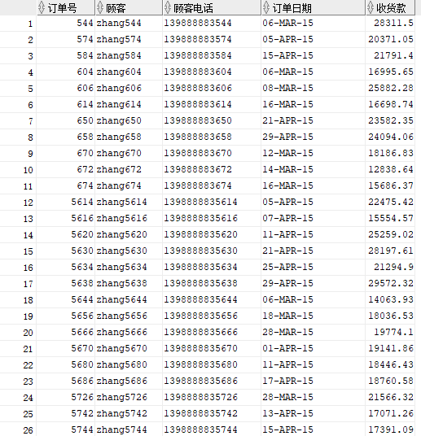
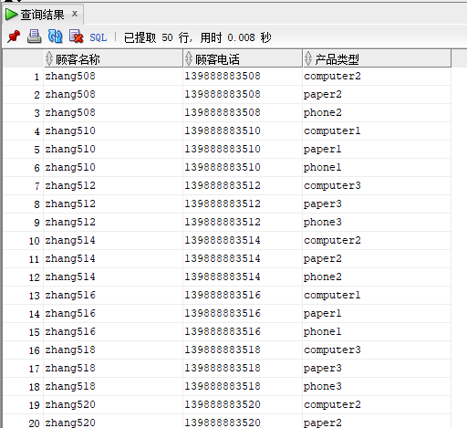
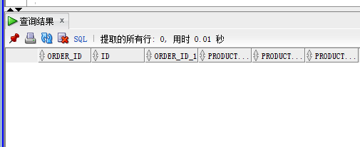
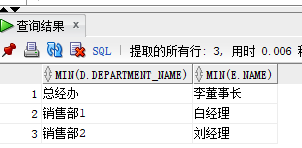
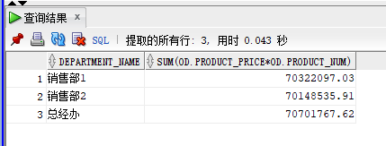

## 实验四 对象管理

### 前提说明
- 使用用户： `user_108`

### 创建表
- 创建之前，先进行检测是否存在相同名字的表，如果存在就删除表
```sql
--删除表和序列
--删除表的同时会一起删除主外键、触发器、程序包。
declare
      num   number;
begin
      select count(1) into num from user_tables where TABLE_NAME = 'DEPARTMENTS';
      if   num=1   then
          execute immediate 'drop table DEPARTMENTS cascade constraints PURGE';
      end   if;

      select count(1) into num from user_tables where TABLE_NAME = 'EMPLOYEES';
      if   num=1   then
          execute immediate 'drop table EMPLOYEES cascade constraints PURGE';
      end   if;

      select count(1) into num from user_tables where TABLE_NAME = 'ORDER_ID_TEMP';
      if   num=1   then
          execute immediate 'drop table ORDER_ID_TEMP cascade constraints PURGE';
      end   if;

      select count(1) into num from user_tables where TABLE_NAME = 'ORDER_DETAILS';
      if   num=1   then
          execute immediate 'drop table ORDER_DETAILS cascade constraints PURGE';
      end   if;

      select count(1) into num from user_tables where TABLE_NAME = 'ORDERS';
      if   num=1   then
          execute immediate 'drop table ORDERS cascade constraints PURGE';
      end   if;

      select count(1) into num from user_tables where TABLE_NAME = 'PRODUCTS';
      if   num=1   then
          execute immediate 'drop table PRODUCTS cascade constraints PURGE';
      end   if;

      select count(1) into num from user_sequences where SEQUENCE_NAME = 'SEQ_ORDER_DETAILS_ID';
      if   num=1   then
          execute immediate 'drop  SEQUENCE SEQ_ORDER_DETAILS_ID';
      end   if;

      select count(1) into num from user_sequences where SEQUENCE_NAME = 'SEQ_ORDER_ID';
      if   num=1   then
          execute immediate 'drop  SEQUENCE SEQ_ORDER_ID';
      end   if;
      select count(1) into num from user_views where VIEW_NAME = 'VIEW_ORDER_DETAILS';
      if   num=1   then
          execute immediate 'drop VIEW VIEW_ORDER_DETAILS';
      end   if;

      SELECT count(object_name)  into num FROM user_objects_ae WHERE object_type = 'PACKAGE' and OBJECT_NAME='MYPACK';
      if   num=1   then
          execute immediate 'DROP PACKAGE MYPACK';
      end   if;
end;
/
```  

- `departments`表
```sql
CREATE TABLE DEPARTMENTS
(
  DEPARTMENT_ID NUMBER(6, 0) NOT NULL
, DEPARTMENT_NAME VARCHAR2(40 BYTE) NOT NULL
, CONSTRAINT DEPARTMENTS_PK PRIMARY KEY
  (
    DEPARTMENT_ID
  )
  USING INDEX
  (
      CREATE UNIQUE INDEX DEPARTMENTS_PK ON DEPARTMENTS (DEPARTMENT_ID ASC)
      NOLOGGING
      TABLESPACE USERS
      PCTFREE 10
      INITRANS 2
      STORAGE
      (
        INITIAL 65536
        NEXT 1048576
        MINEXTENTS 1
        MAXEXTENTS UNLIMITED
        BUFFER_POOL DEFAULT
      )
      NOPARALLEL
  )
  ENABLE
)
NOLOGGING
TABLESPACE USERS
PCTFREE 10
INITRANS 1
STORAGE
(
  INITIAL 65536
  NEXT 1048576
  MINEXTENTS 1
  MAXEXTENTS UNLIMITED
  BUFFER_POOL DEFAULT
)
NOCOMPRESS NO INMEMORY NOPARALLEL;
```
- `products`表
```sql
CREATE TABLE PRODUCTS
(
  PRODUCT_NAME VARCHAR2(40 BYTE) NOT NULL
, PRODUCT_TYPE VARCHAR2(40 BYTE) NOT NULL
, CONSTRAINT PRODUCTS_PK PRIMARY KEY
  (
    PRODUCT_NAME
  )
  ENABLE
)
LOGGING
TABLESPACE "USERS"
PCTFREE 10
INITRANS 1
STORAGE
(
  INITIAL 65536
  NEXT 1048576
  MINEXTENTS 1
  MAXEXTENTS 2147483645
  BUFFER_POOL DEFAULT
);

ALTER TABLE PRODUCTS
ADD CONSTRAINT PRODUCTS_CHK1 CHECK
(PRODUCT_TYPE IN ('耗材', '手机', '电脑'))
ENABLE;
```
  

- `employees`表
```sql
CREATE TABLE EMPLOYEES
(
  EMPLOYEE_ID NUMBER(6, 0) NOT NULL
, NAME VARCHAR2(40 BYTE) NOT NULL
, EMAIL VARCHAR2(40 BYTE)
, PHONE_NUMBER VARCHAR2(40 BYTE)
, HIRE_DATE DATE NOT NULL
, SALARY NUMBER(8, 2)
, MANAGER_ID NUMBER(6, 0)
, DEPARTMENT_ID NUMBER(6, 0)
, PHOTO BLOB
, CONSTRAINT EMPLOYEES_PK PRIMARY KEY
  (
    EMPLOYEE_ID
  )
  USING INDEX
  (
      CREATE UNIQUE INDEX EMPLOYEES_PK ON EMPLOYEES (EMPLOYEE_ID ASC)
      NOLOGGING
      TABLESPACE USERS
      PCTFREE 10
      INITRANS 2
      STORAGE
      (
        INITIAL 65536
        NEXT 1048576
        MINEXTENTS 1
        MAXEXTENTS UNLIMITED
        BUFFER_POOL DEFAULT
      )
      NOPARALLEL
  )
  ENABLE
)
NOLOGGING
TABLESPACE USERS
PCTFREE 10
INITRANS 1
STORAGE
(
  INITIAL 65536
  NEXT 1048576
  MINEXTENTS 1
  MAXEXTENTS UNLIMITED
  BUFFER_POOL DEFAULT
)
NOCOMPRESS
NO INMEMORY
NOPARALLEL
LOB (PHOTO) STORE AS SYS_LOB0000092017C00009$$
(
  ENABLE STORAGE IN ROW
  CHUNK 8192
  NOCACHE
  NOLOGGING
  TABLESPACE USERS
  STORAGE
  (
    INITIAL 106496
    NEXT 1048576
    MINEXTENTS 1
    MAXEXTENTS UNLIMITED
    BUFFER_POOL DEFAULT
  )
);

CREATE INDEX EMPLOYEES_INDEX1_NAME ON EMPLOYEES (NAME ASC)
NOLOGGING
TABLESPACE USERS
PCTFREE 10
INITRANS 2
STORAGE
(
  INITIAL 65536
  NEXT 1048576
  MINEXTENTS 1
  MAXEXTENTS UNLIMITED
  BUFFER_POOL DEFAULT
)
NOPARALLEL;

ALTER TABLE EMPLOYEES
ADD CONSTRAINT EMPLOYEES_FK1 FOREIGN KEY
(
  DEPARTMENT_ID
)
REFERENCES DEPARTMENTS
(
  DEPARTMENT_ID
)
ENABLE;

ALTER TABLE EMPLOYEES
ADD CONSTRAINT EMPLOYEES_FK2 FOREIGN KEY
(
  MANAGER_ID
)
REFERENCES EMPLOYEES
(
  EMPLOYEE_ID
)
ON DELETE SET NULL ENABLE;

ALTER TABLE EMPLOYEES
ADD CONSTRAINT EMPLOYEES_CHK1 CHECK
(SALARY>0)
ENABLE;

ALTER TABLE EMPLOYEES
ADD CONSTRAINT EMPLOYEES_CHK2 CHECK
(EMPLOYEE_ID<>MANAGER_ID)
ENABLE;

ALTER TABLE EMPLOYEES
ADD CONSTRAINT EMPLOYEES_EMPLOYEE_MANAGER_ID CHECK
(MANAGER_ID<>EMPLOYEE_ID)
ENABLE;

ALTER TABLE EMPLOYEES
ADD CONSTRAINT EMPLOYEES_SALARY CHECK
(SALARY>0)
ENABLE;

```
- `orders`表  
```sql
CREATE TABLE ORDERS
(
  ORDER_ID NUMBER(10, 0) NOT NULL
, CUSTOMER_NAME VARCHAR2(40 BYTE) NOT NULL
, CUSTOMER_TEL VARCHAR2(40 BYTE) NOT NULL
, ORDER_DATE DATE NOT NULL
, EMPLOYEE_ID NUMBER(6, 0) NOT NULL
, DISCOUNT NUMBER(8, 2) DEFAULT 0
, TRADE_RECEIVABLE NUMBER(8, 2) DEFAULT 0
)
TABLESPACE USERS
PCTFREE 10
INITRANS 1
STORAGE
(
  BUFFER_POOL DEFAULT
)
NOCOMPRESS
NOPARALLEL
PARTITION BY RANGE (ORDER_DATE)
(
  PARTITION PARTITION_BEFORE_2016 VALUES LESS THAN (TO_DATE(' 2016-01-01 00:00:00', 'SYYYY-MM-DD HH24:MI:SS', 'NLS_CALENDAR=GREGORIAN'))
  NOLOGGING
  TABLESPACE USERS
  PCTFREE 10
  INITRANS 1
  STORAGE
  (
    INITIAL 8388608
    NEXT 1048576
    MINEXTENTS 1
    MAXEXTENTS UNLIMITED
    BUFFER_POOL DEFAULT
  )
  NOCOMPRESS NO INMEMORY
, PARTITION PARTITION_BEFORE_2017 VALUES LESS THAN (TO_DATE(' 2017-01-01 00:00:00', 'SYYYY-MM-DD HH24:MI:SS', 'NLS_CALENDAR=GREGORIAN'))
  NOLOGGING
  TABLESPACE USERS02
  PCTFREE 10
  INITRANS 1
  STORAGE
  (
    INITIAL 8388608
    NEXT 1048576
    MINEXTENTS 1
    MAXEXTENTS UNLIMITED
    BUFFER_POOL DEFAULT
  )
  NOCOMPRESS NO INMEMORY
);
```
- `order_details`表  
```sql
CREATE TABLE ORDER_DETAILS
(
  ID NUMBER(10, 0) NOT NULL
, ORDER_ID NUMBER(10, 0) NOT NULL
, PRODUCT_NAME VARCHAR2(40 BYTE) NOT NULL
, PRODUCT_NUM NUMBER(8, 2) NOT NULL
, PRODUCT_PRICE NUMBER(8, 2) NOT NULL
, CONSTRAINT ORDER_DETAILS_FK1 FOREIGN KEY
  (
  ORDER_ID
  )
  REFERENCES ORDERS
  (
  ORDER_ID
  )
  ENABLE
)
TABLESPACE USERS
PCTFREE 10
INITRANS 1
STORAGE
(
  BUFFER_POOL DEFAULT
)
NOCOMPRESS
NOPARALLEL
PARTITION BY REFERENCE (ORDER_DETAILS_FK1)
(
  PARTITION PARTITION_BEFORE_2016
  NOLOGGING
  TABLESPACE USERS --必须指定表空间，否则会将分区存储在用户的默认表空间中
  PCTFREE 10
  INITRANS 1
  STORAGE
  (
    INITIAL 8388608
    NEXT 1048576
    MINEXTENTS 1
    MAXEXTENTS UNLIMITED
    BUFFER_POOL DEFAULT
  )
  NOCOMPRESS NO INMEMORY,
  PARTITION PARTITION_BEFORE_2017
  NOLOGGING
  TABLESPACE USERS02
  PCTFREE 10
  INITRANS 1
  STORAGE
  (
    INITIAL 8388608
    NEXT 1048576
    MINEXTENTS 1
    MAXEXTENTS UNLIMITED
    BUFFER_POOL DEFAULT
  )
  NOCOMPRESS NO INMEMORY
)
;
```
- 创建表的效果  


### 创建序列以及插入数据时序列的应用
- 创建序列  
```sql
CREATE SEQUENCE  "SEQ_ORDER_ID"  MINVALUE 1 MAXVALUE 9999999999 INCREMENT BY 1 START WITH 1 CACHE 2000 ORDER  NOCYCLE  NOPARTITION ;
CREATE SEQUENCE  "SEQ_ORDER_DETAILS_ID"  MINVALUE 1 MAXVALUE 9999999999 INCREMENT BY 1 START WITH 1 CACHE 2000 ORDER  NOCYCLE  NOPARTITION ;
```

- 插入数据时序列应用
```sql
v_order_id:=SEQ_ORDER_ID.nextval; 
insert /*+append*/ into ORDER_DETAILS(ID,ORDER_ID,PRODUCT_NAME,PRODUCT_NUM,PRODUCT_PRICE)
  values (SEQ_ORDER_DETAILS_ID.NEXTVAL,v_order_id,v_name,2,v);
v:=dbms_random.value(1000,50);
v_name:='paper'|| (i mod 3 + 1);
insert /*+append*/ into ORDER_DETAILS(ID,ORDER_ID,PRODUCT_NAME,PRODUCT_NUM,PRODUCT_PRICE)
  values (SEQ_ORDER_DETAILS_ID.NEXTVAL,v_order_id,v_name,3,v);
v:=dbms_random.value(9000,2000);
v_name:='phone'|| (i mod 3 + 1);
insert /*+append*/ into ORDER_DETAILS(ID,ORDER_ID,PRODUCT_NAME,PRODUCT_NUM,PRODUCT_PRICE)
  values (SEQ_ORDER_DETAILS_ID.NEXTVAL,v_order_id,v_name,1,v);
```

### 查询数据
- 查询某个员工的信息
    - code
    ```sql
    select * from employees where department_id = 1 and name = '张总';
    ```
    - picture  
    
- 递归查询某个员工及其所有下属，子下属员工
    - code
    ```sql
    select * from employees e start with e.employee_id = '11'
    connect by prior e.employee_id = e.manager_id;
    ```
    - picture  
    
- 查询订单表，并且包括订单的订单应收货款: Trade_Receivable= sum(订单详单表.ProductNum*订单详单表.ProductPrice)- Discount。
    - code
    ```sql
    select o.ORDER_ID as "订单号", min(o.CUSTOMER_NAME) as "顾客", min(o.CUSTOMER_TEL) as "顾客电话", 
    min(o.ORDER_DATE) as "订单日期", sum(od.PRODUCT_NUM*od.PRODUCT_PRICE) - sum(o.DISCOUNT)/count(o.discount) as "收货款" 
    from ORDERS o, ORDER_DETAILS od
    where o.ORDER_ID = od.ORDER_ID
    group by o.ORDER_ID
    ```
    - picture  
    
- 查询订单详表，要求显示订单的客户名称和客户电话，产品类型用汉字描述。
    - code
    ```sql
    select o.CUSTOMER_NAME as "顾客名称", o.CUSTOMER_TEL as "顾客电话", od.PRODUCT_NAME as "产品类型"
    from ORDERS o, ORDER_DETAILS od
    where o.order_id = od.order_id
    ```
    - picture  
    
- 查询出所有空订单，即没有订单详单的订单。
    - code
    ```sql
    SELECT o.order_id, od.*FROM ORDERS o 
    LEFT JOIN ORDER_DETAILS od 
    ON o.order_id = od.order_id
    WHERE od.id IS NULL  
    ```
    - picture  
    
- 查询部门表，同时显示部门的负责人姓名。
    - code
    ```sql
    SELECT min(d.department_name),min(e.name)
    FROM DEPARTMENTS d, EMPLOYEES e
    WHERE d.department_id = e.department_id
    GROUP BY d.DEPARTMENT_ID
    ```
    - picture  
    
- 查询部门表，统计每个部门的销售总金额。
    - code
    ```sql
    SELECT d.department_name, sum(od.product_price*od.product_num)
    FROM EMPLOYEES e, DEPARTMENTS d, ORDERS o, ORDER_DETAILS od
    WHERE e.department_id = d.department_id 
    and e.employee_id = o.employee_id
    and o.order_id = od.order_id
    GROUP BY d.department_name
    ```
    - picture  
    